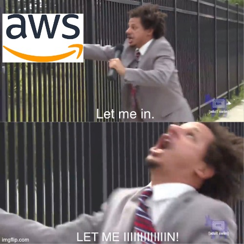

# let-me-in

A CLI tool to easily SSH into an ECS container using SSM Session Manager.

<script src="https://asciinema.org/a/ao7mlvJMdkfon36QhInqBK78I.js" id="asciicast-ao7mlvJMdkfon36QhInqBK78I" async="true"></script>

## Quickstart

```
npx @chaseconey/let-me-in
```

This will prompt you through all of your clusters, services, tasks, and containers to give you the appropriate destination.

### Example Usage

There are quite a few options that you can pass to streamline connecting to your container. Here are a few examples:

#### Passing Cluster and Service Name

```
npx @chaseconey/let-me-in -c prod -s app-prod-1
```

This will skip prompting for the cluster and service, and move on to the task selection automatically.

Additionally, if there is only 1 task and 1 container, it will assume that is what you want and move on.

#### Changing the Target Region

```
npx @chaseconey/let-me-in -r us-west-2
```

This will search for resources in the `us-west-2` region. For a list of available regions, check out the [AWS docs](https://aws.amazon.com/about-aws/global-infrastructure/regional-product-services/).

### AWS Credential Handling

This CLI uses the AWS Javascript SDK, which uses the normal "AWS Credential Provider Chain". This basically means it will try and load the credentials in many different ways, but in a specific order.

For more details, check out the [AWS docs](https://docs.aws.amazon.com/sdk-for-java/latest/developer-guide/credentials-chain.html#credentials-default).

> [!NOTE]  
> We provide passing the `profile` using the `-p` or `--profile` flags.
